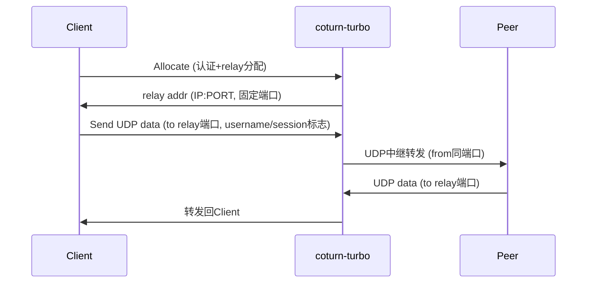
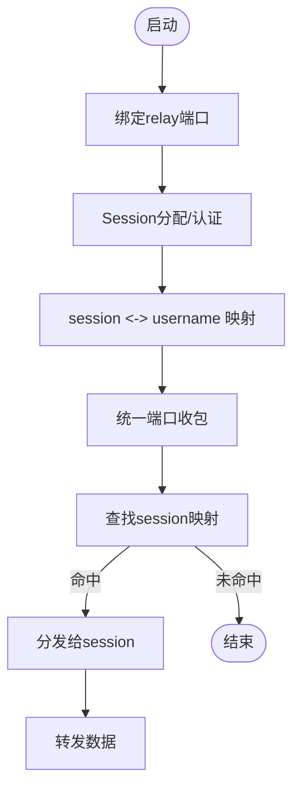

# coturn-turbo: 单端口UDP relay复用+username隔离方案设计

## 1. 方案目标

- 所有relay UDP数据统一收敛到1个端口（如40000），放弃UDP端口区间随机分配。
- 不同TURN session间用username(或transaction/session-id)区分，实现多路复用。
- 逻辑预留集成io_uring/libevent和AF_XDP（Linux高性能网络IO）。
- 兼容WebRTC的TURN/ICE客户端，在大多数网络环境下最简端口部署。

---

## 2. 核心逻辑骨架

### 2.1 现有coturn relay UDP流程

1. 客户端建立TURN session（认证）。
2. 客户端请求relay时，coturn为每session分配独立UDP socket和端口（通常49152~65535随机）。
3. relay数据通过各自独立的端口转发。

### 2.2 拟改造relay UDP端口分配流程

1. coturn启动时仅监听1个relay UDP端口（可配置，如40000）。
2. 所有TURN client分配relay地址时，获得的端口均为此端口。
3. relay的下游转发和数据收包都通过该socket完成，coturn用(username、session-id、5元组)定位session。
4. Session状态/认证/归属校验照常，IO层负责正确mux/demux。

---

## 3. 主要模块 & 伪代码骨架

### 3.1 主要模块职责

- `single_udp_relay_manager.c`：Relay端口与socket生命周期管理；session与username映射&查找。
- `event_loop_patch.c`：事件驱动收发patch，实现io_uring/Af_xdp后端可切换。
- 核心流程入口在`turn_server.c`和`turn_ports.c`，hook端口分配及relay socket逻辑。

### 3.2 主要伪代码框架

```c
// 启动阶段
global int relay_fd = bind_udp(PORT);

// 新session分配relay
func allocate_relay(username, client_tuple) {
    session_id = make_session_id(username, client_tuple);
    relay_port = PORT; // 固定端口
    session_table[session_id] = { username, client_tuple, ...}
    return relay_port;
}

// 收包主循环
while (running) {
    packet, src_tuple = recvfrom(relay_fd, ...);
    session = session_table.lookup_by_tuple_or_username(src_tuple, packet);
    if (session) dispatch_packet(session, packet);
    else discard/log;
}

// 发包
func send_to_peer(session, data, dst_addr) {
    sendto(relay_fd, data, ..., dst_addr);
}
```

---

## 4. 时序/流程图

### 4.1 时序图：单端口relay交互



### 4.2 流程图



---

## 5. 数据流/数据结构

```mermaid
flowchart LR
    subgraph Relay端口复用引擎
        UDP[relay UDP socket (单端口)]
        PKG[数据包]
        LOOKUP[session查找表(username/tuple)]
        SESSION[session上下文]
    end

    UDP --> PKG --> LOOKUP --> SESSION
    SESSION --> UDP
```

- **核心表**：
    - session查找表（username/session-id+tuple为key，session对象为value）
    - 统一relay socket为所有session复用

---

## 6. 性能优化预留点

- event loop 抽象为可插拔后端（可用libevent、io_uring、AF_XDP）。
- session查找表强制用哈希或LRU提升百万级并发定位效率。
- 收发包主循环预留io_uring或AF_XDP注册接口。

---

## 7. 兼容性和风险说明

- 大多数NAT可用，对称NAT下性能或穿透能力可能下降。
- 安全隔离完全依赖软件session映射，恶意client可能DoS复用端口。
- 需额外完善速率限制和session状态清理机制。

---

## 8. FAQ与参考

- 参考coturn原有代码：`turn_server.c`, `turn_ports.c`
- 性能与网络栈：libevent源码/io_uring(CLIB)/AF_XDP[官方文档](https://www.kernel.org/doc/html/latest/networking/af_xdp.html)
- 本方案适用于“超简部署、特定受控环境端口极简、兼容WebRTC业务场景”。

---

以上为 coturn UDP relay单端口多会话复用的核心方案设计。如需深入到具体实现函数或有特殊应用场景，可继续讨论。